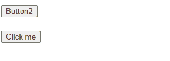

# 记一次权限按钮渲染异常

最近在开发公司的项目中出现了一次渲染异常。大致的情况如下：

页面上有几个操作按钮同时绑定了 v-if 和 v-permission（权限控制）。但是当我改变 v-if 绑定值的时候，原本应该被渲染的按钮没有显示出来。

## 复现代码

下面提供了一个可复现的最小代码版本：

```html
<!DOCTYPE html>
<html lang="zh-CN">
<head>
  <meta charset="UTF-8">
  <meta http-equiv="X-UA-Compatible" content="IE=edge">
  <meta name="viewport" content="width=device-width, initial-scale=1.0">
  <title>最小复现版本</title>
</head>
<body>
  <div id="app">
    <div>
      <button v-if="showBtn1" v-permission:btn1>Button1</button>
      <button v-if="showBtn2" v-permission:btn2>Button2</button>
      <button v-if="showBtn3" v-permission:btn3>Button3</button>
    </div>
    <br>
    <button @click="onClick">Click me</button>
  </div>
  <script src="https://cdn.bootcdn.net/ajax/libs/vue/2.6.9/vue.js"></script>
  <script>
    const whiteList = ['btn1', 'btn2']
    Vue.directive('permission', {
      inserted: function (el, info, vnode) {
        if (!whiteList.includes(info.arg)) {
          el.parentElement && el.parentElement.removeChild(el)
        }
      }
    })
    new Vue({
      el: '#app',
      data: {
        showBtn1: false,
        showBtn2: true,
        showBtn3: true
      },
      methods: {
        onClick () {
          this.showBtn1 = true
          this.showBtn2 = true
          this.showBtn3 = false
        }
      }
    })
  </script>
</body>
</html>
```



可以看到点击按钮后，原本应该显示的 Button2 不见了。

经过一番排查之后发现，是因为权限相关的自定义指令写的有问题。

```javascript
Vue.directive('permission', {
  inserted: function (el, info, vnode) {
    if (!whiteList.includes(info.arg)) {
      // 这里不能直接将这个dom元素从文档中删除
      el.parentElement && el.parentElement.removeChild(el)
    }
  }
})
```

## 原因分析

当我们直接将元素从文档中删除时，vue 是感知不到的。

虽然文档中删除了这个元素，但是对应的 vnode 中有 elm 属性引用这个 dom 元素。

当后续 Vue 进行 diff 的时候更新这个元素实际上改动的是被删除的dom元素，因此视图不会变化。

```js
// 之前的 vnode 顺序
undefined btn2 btn3
// 修改后的 vnode 顺序
btn1 btn2 undefined
```

由于 vnode 没有设置 key， diff 的过程是：

1. 将 undefined 移动到队列末尾

2. 将 btn2 => btn1

3. 将 btn3 => btn2

由于将 btn3 从文档中删除了，对 btn3 的修改不会显示到视图上。

因此导致渲染错误。

## 解决办法

+ 使用 `v-show` 替代 `v-if`。
+ 不要将 `v-permission` 和 `v-if` 放在同一个层级下。

```javascript
<div v-permission:btn1>
  <a-button v-if="showBtn1" type="primary">Button1</a-button>
</div>
```
