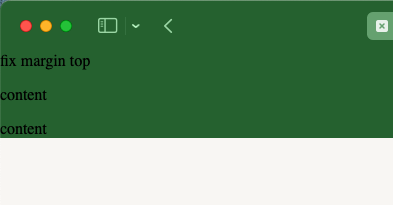
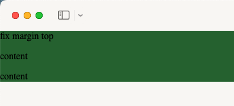

# safari 标题栏颜色显示网页内容背景色

在开发过程中，存在下面的场景：

网页的 body 元素有一个背景色 `#f9f7f5`，内容 app 元素也存在一个背景色 `#296c35`, 此时 safari 标题栏的颜色会和内容 app 元素的背景色一致，而不是 body 元素的背景色。

<div class="flex justify-center">
    
</div>

此时可以通过设置 meta 标签的 [`theme-color`](https://developer.mozilla.org/zh-CN/docs/Web/HTML/Element/meta/name/theme-color) 属性来解决这个问题。

> `<meta>` 中 `name` 属性的值为 `theme-color` 时，用户的浏览器将根据所设定的建议颜色来改变用户界面。倘若设置了该值，则 `content` 属性必须包含有效的 `CSS <color>` 值。

```html
<meta name="theme-color" content="#ffffff" />
```

但是将 `theme-color` 设置为 `#ffffff` 后，标题栏的颜色并没有改变。

出现这个问题的原因是 safari 会根据网页的对比度来判断，如果对比度过高，那么 `theme-color` 就会失效。

可以通过这个网站测试 theme-color 是否生效：[https://roger.zone/theme-color-preview/](https://roger.zone/theme-color-preview/)

最后的解决方案就是设置 theme-color 的值为 `#f9f7f5`，这样就可以解决这个问题了。

<div class="flex justify-center">
    
</div>

::: details 代码示例

```html
<!DOCTYPE html>
<html lang="en">
    <head>
        <meta charset="UTF-8" />
        <meta http-equiv="X-UA-Compatible" content="IE=edge" />
        <meta name="viewport" content="width=device-width, initial-scale=1.0" />
        <!-- 此时设置 #ffffff 不起作用 -->
        <!-- <meta name="theme-color" content="#ffffff" /> -->
        <!-- 设置 #f9f7f5 可以解决这个问题 -->
        <meta name="theme-color" content="#f9f7f5" />
        <title>Document</title>
        <style>
            html,
            body {
                margin: 0;
                padding: 0;
            }
            body {
                background-color: #f9f7f5;
                padding-bottom: env(safe-area-inset-bottom);
            }
            #app {
                background-color: #296c35;
            }
        </style>
    </head>
    <body>
        <div id="app">
            <div>fix margin top</div>
            <p>content</p>
            <p>content</p>
        </div>
    </body>
</html>
```

:::

## References

-   [MDN](https://developer.mozilla.org/zh-CN/docs/Web/HTML/Element/meta/name/theme-color)
-   [Meta Theme Color and Trickery](https://css-tricks.com/meta-theme-color-and-trickery/#aa-prohibited-colors)
-   [Safari 15+ Theme Color Preview](https://roger.zone/theme-color-preview/)
