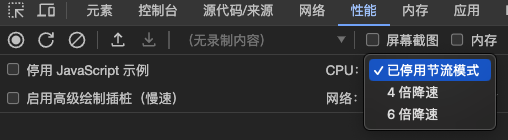
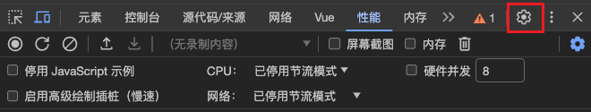
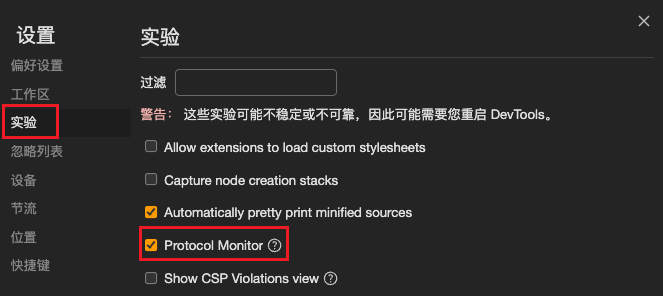
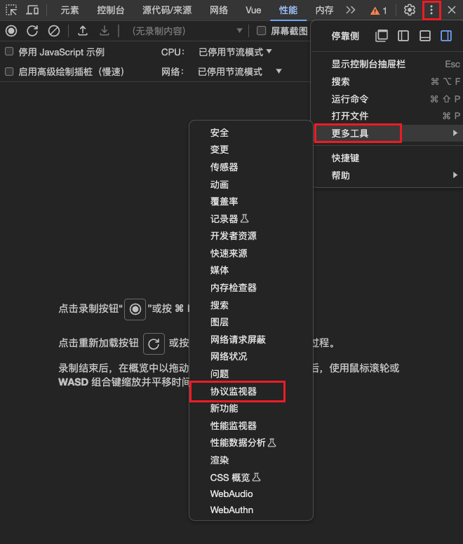
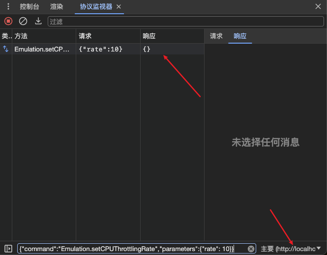

# 手动设置 Chrome Devtools 中的 CUP 性能降速倍率

在 Chrome 开发者工具中，可以手动设置 CUP 性能降速倍率。用来模拟某些低速设备的情况。但是这个默认最低只能到6倍降速，有时我们可能需要更低的 cup 性能降速倍率。



本文将介绍如何在 Chrome 开发者工具中手动设置 CUP 性能降速倍率。

## 设置 cup 性能降速倍率

1. 打开 Chrome Devtools，点击右上角的设置按钮。



2. 找到实验一栏，并勾选 `Protocol Monitor` 选项，然后重新 Devtools。



3. 在 自定义 Devtools -> 更多工具 里找到 协议监控器 并打开。



4. 选择指定的标签页，输入原始 `CDP` 命令。如果响应 `{}` 则表示设置成功。

```json
{"command":"Emulation.setCPUThrottlingRate","parameters":{"rate": 10}}
```




## Refs

+ [如何在 Chrome DevTools 中模拟 10 倍性能降低?](https://segmentfault.com/q/1010000044521029)
+ [I wanna make CPU slower than default setting in chrome devtool 😣!](https://dev.to/kaziusan/i-wanna-make-cpu-slower-than-default-setting-in-chrome-devtool--3bb)
+ [Is it possible to set custom CPU throttling in Chrome DevTools?](https://stackoverflow.com/questions/48751988/is-it-possible-to-set-custom-cpu-throttling-in-chrome-devtools)
+ [Chrome Devtools Frontend Source Code](https://github.com/ChromeDevTools/devtools-frontend/blob/d00d10d6f5adcb3c705c4f81b889c59bcb904d28/front_end/generated/protocol-mapping.d.ts#L2020C16-L2020C36)