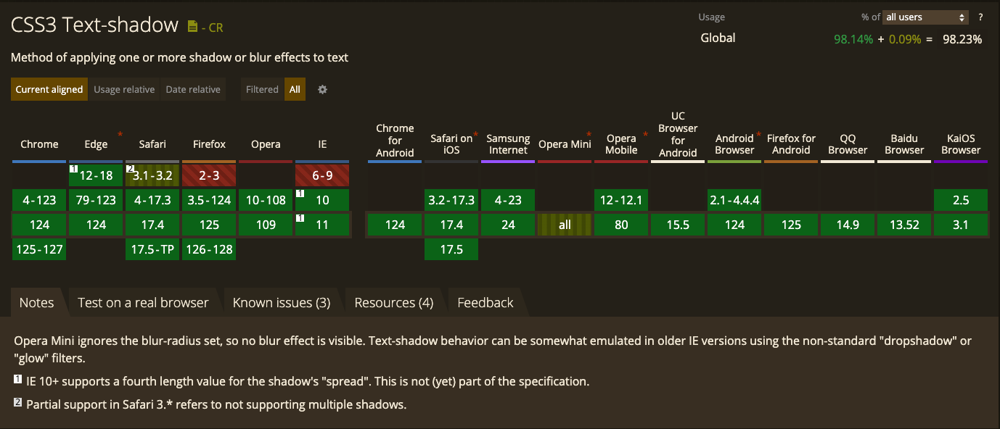

# 文字描边

<script lang="ts" setup>
  import ButtonGroup from "@/components/Form/components/ButtonGroup.vue"
  import { ref } from 'vue'

  const playWebkitAnimation= ref('关闭')
</script>

Web端实现文字描边一般有以下几种方式。

## 文字阴影

第一种是使用 `text-shadow` 属性，通过将文字阴影向8个方向偏移，从而达到文字描边的效果。

<div class="stroke-use-shadow">Vitepress Text Stroke</div>

::: details 实例代码

```html
<div class="stroke-use-shadow">Vitepress Text Stroke</div>
<style>
  .stroke-use-shadow {
    font-size: 48px;
    color: var(--vp-c-brand-1);
    line-height: 1;
    --web-text-stroke-color: var(--vp-c-text-1);
    text-shadow:
      0 -2px 0 var(--web-text-stroke-color),
      2px -2px 0 var(--web-text-stroke-color),
      2px 0 0 var(--web-text-stroke-color),
      2px 2px 0 var(--web-text-stroke-color),
      0 2px 0 var(--web-text-stroke-color),
      -2px 2px 0 var(--web-text-stroke-color),
      -2px 0 0 var(--web-text-stroke-color),
      -2px -2px 0 var(--web-text-stroke-color);
  }
</style>
```
:::

这种方案的优点在于兼容性最好， ie 10 也支持该css属性。



但是这种方案的缺点也最明显：

1. 文字的描边宽度不均匀。

    由于阴影效果是通过设置偏移实现的，所以必然会导致有些地方的描边宽一些，有些地方的描边窄一些。解决方式是设置更多的偏移方向，但是仍然难以达到描边宽度均匀的效果。

2. 描边的宽度不能太大。

    如下所示：如果描边的宽度比文字本身要大的话，设置的偏移量就会过大，从而导致描边的部分存在空隙。

    ::: details 示例
    <div class="stroke-use-shadow-large-width mb4">Vitepress Text Stroke</div>

    ```html
    <div class="stroke-use-shadow-large-width">Vitepress Text Stroke</div>
    <style>
      .stroke-use-shadow-large-width {
        font-size: 48px;
        color: var(--vp-c-brand-1);
        line-height: 1;
        --web-text-stroke-color: var(--vp-c-text-1);
        text-shadow:
          0 -6px 0 var(--web-text-stroke-color),
          6px -6px 0 var(--web-text-stroke-color),
          6px 0 0 var(--web-text-stroke-color),
          6px 6px 0 var(--web-text-stroke-color),
          0 6px 0 var(--web-text-stroke-color),
          -6px 6px 0 var(--web-text-stroke-color),
          -6px 0 0 var(--web-text-stroke-color),
          -6px -6px 0 var(--web-text-stroke-color);
      }
    ```
    :::

3. 描边的边缘处不协调，如果用扩散阴影来处理，会导致文字看起来比较糊。

    <div class="stroke-use-shadow-large-blur mb4">Vitepress Text Stroke</div>

## 使用 `text-stroke` 设置文字描边

第二种方案是使用 `-webkit-text-stroke` 属性设置文字的描边。

<div class="text-stroke-with-webkit mb4" data-stroke-text="Vitepress Text Stroke">Vitepress Text Stroke</div>

注意：`-webkit-text-stroke` 默认是居中描边，也就是当设置描边宽度为4像素时，实际会向外描边2px，同时向内描边2px。

<div class="flex items-center gap2 mb4">
  <div>点击下方按钮可以观察文字描边效果</div>
  <ButtonGroup v-model="playWebkitAnimation" :data-source="['开启', '关闭']"></ButtonGroup>
</div>

<div class="text-stroke-with-webkit-base">Vitepress Text Stroke</div>

<div class="text-stroke-raw" :class="playWebkitAnimation === '关闭' ? 'animate-paused' : 'animate-running'">Vitepress Text Stroke</div>

## 使用 SVG 文字描边


<style lang="less" scoped>
  .stroke-text {
    font-size: 48px;
    color: var(--vp-c-brand-1);
    line-height: 1;
    --web-text-stroke-color: var(--vp-c-text-1);
  }

  .stroke-use-shadow {
    .stroke-text;
    text-shadow:
      0 -2px 0 var(--web-text-stroke-color),
      2px -2px 0 var(--web-text-stroke-color),
      2px 0 0 var(--web-text-stroke-color),
      2px 2px 0 var(--web-text-stroke-color),
      0 2px 0 var(--web-text-stroke-color),
      -2px 2px 0 var(--web-text-stroke-color),
      -2px 0 0 var(--web-text-stroke-color),
      -2px -2px 0 var(--web-text-stroke-color);
  }

  .stroke-use-shadow-large-blur {
    .stroke-text;
    text-shadow:
      0 -2px 2px var(--web-text-stroke-color),
      2px -2px 2px var(--web-text-stroke-color),
      2px 0 2px var(--web-text-stroke-color),
      2px 2px 2px var(--web-text-stroke-color),
      0 2px 2px var(--web-text-stroke-color),
      -2px 2px 2px var(--web-text-stroke-color),
      -2px 0 2px var(--web-text-stroke-color),
      -2px -2px 2px var(--web-text-stroke-color);
  }

  .stroke-use-shadow-large-width {
    .stroke-text;
    text-shadow:
      0 -6px 0 var(--web-text-stroke-color),
      6px -6px 0 var(--web-text-stroke-color),
      6px 0 0 var(--web-text-stroke-color),
      6px 6px 0 var(--web-text-stroke-color),
      0 6px 0 var(--web-text-stroke-color),
      -6px 6px 0 var(--web-text-stroke-color),
      -6px 0 0 var(--web-text-stroke-color),
      -6px -6px 0 var(--web-text-stroke-color);
  }

  .text-stroke-with-webkit {
    position: relative;
    .stroke-text;
    --web-text-stroke-width: 2px;
    -webkit-text-stroke: var(--web-text-stroke-width) var(--web-text-stroke-color);
    &::after {
      content: attr(data-stroke-text);
      font-size: 48px;
      color: var(--vp-c-brand-1);
      line-height: 1;
      -webkit-text-stroke: 0;
      position: absolute;
      left: 0;
      top: 100%;
      transform: translateY(-100%);
    }
  }

  .text-stroke-with-webkit-base {
    .stroke-text;
    --web-text-stroke-width: 2px;
    -webkit-text-stroke: var(--web-text-stroke-width) var(--web-text-stroke-color);
  }

  .text-stroke-raw {
    .stroke-text;
    animation-name: stroke-with-webkit-cover;
    animation-duration: 2s;
    animation-iteration-count: infinite;
  }

  @keyframes stroke-with-webkit-cover {
    to { transform: translateY(-100%); }
  }
</style>